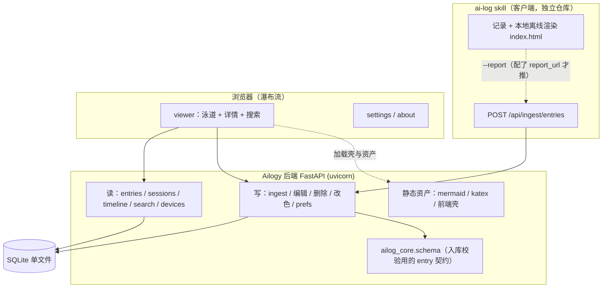
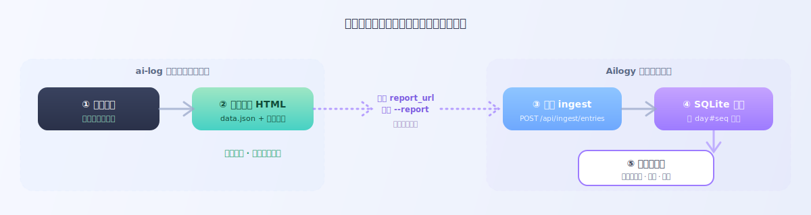

# Ailogy


AI 工作日志**纯后端服务**：接收上报 → SQLite 存库 → 网页瀑布流查看，**纯个人使用，零鉴权**。

> 本项目脱胎于 [claude-skills 的 ai-log skill](https://github.com/icloudsheep/claude-skills)。**职责已彻底拆分**：
> - **[ai-log skill](https://github.com/icloudsheep/claude-skills/tree/main/skills/ai-log) = 客户端**：专职记录日志、本地离线渲染、（可选）推送云端；自包含，只装它即可全功能本地离线使用。
> - **Ailogy（本仓库）= 纯后端**：只负责收集 / 存储 / 网页呈现多设备汇聚的日志，**自身不产生日志、不含写日志的 CLI**。
>
> 二者靠 ai-log 侧配置的云端地址（`report_url`）单向对接：ai-log 带 `--report` 时把日志 POST 到本服务。云端地址配在 **ai-log 自己的 config**，**不在本仓库的 `.env` 里**——本仓库的 `.env` 只管后端自身的 DB / 监听地址。

---

## 它能做什么

- **汇聚多设备上报**：接收 ai-log 客户端带 `--report` 的 POST，多台设备的日志汇聚到一个库；也可直接调 API 入库。
- **泳道瀑布流**：会话为列、条目为节点的时间线视图，支持 Markdown / Mermaid 图 / LaTeX 公式渲染、全文搜索。
- **按月 + 按设备筛选**：顶部月份选择器 + 设备选择器（全选 / 多选 / 单选），天/会话两级胶囊各自切显隐。
- **编辑 / 删除 / 改色固化**：节点右键可预览、编辑、删除；会话可重命名、改主题色——编辑/删除/改色直接固化到 SQLite，重命名/选择器状态/主题存浏览器 localStorage。

> 本地离线记录、双击即看的 HTML 由 [ai-log skill](https://github.com/icloudsheep/claude-skills/tree/main/skills/ai-log) 客户端负责，本服务不涉及。

---

## 架构一览



核心取舍：**渲染留前端、后端吐 JSON**；**记录留客户端、后端只收不产**。后端只做数据、无鉴权（本地 / 内网自用）；入库时用 `ailog_core.schema.Entry` 校验请求体形状，与客户端上报的字段对齐。

---

## 整体运行流程



一条日志从产生到能被多设备汇聚查看，经过下面几步。**关键点：前两步只发生在客户端、始终成立；后面三步只有在「配了云端地址 + 后端在跑」时才发生。**

1. **记录（客户端）**：在 ai-log skill 里说「记录日志」，它总结「上次记录到现在」的工作，拟标题 + 正文。
2. **本地离线渲染（客户端，始终发生）**：写入按天目录的 `data.json` 并生成离线 `index.html`，双击即看，**不需要本服务、不需要网络**。到这一步，只装 ai-log 的用户就已经全功能可用了。
3. **上报判定（客户端）**：仅当客户端 `config.json` 配了 `report_url`、且本次带了 `--report`（或用户说「双提交 / 在线提交」）时，才把这条日志 `POST` 到本服务；否则流程止于本地。
4. **入库（后端）**：本服务 `/api/ingest/entries` 收到后用 `ailog_core.schema.Entry` 校验，按 `day#seq` 幂等 upsert 进 SQLite（重复上报是覆盖而非重复插入）。
5. **查看（后端）**：浏览器打开瀑布流，按月 / 设备筛选、全文搜索、右键编辑 / 删除 / 改色，改动固化回 SQLite。

**两种使用姿态**：

| 装了什么 | 记录 | 本地离线 HTML | 云端汇聚 / 瀑布流 |
| --- | --- | --- | --- |
| 只有 ai-log | ✅ | ✅ | ❌ |
| ai-log 配了云端地址 + 本后端在跑 | ✅ | ✅ | ✅ |

> 后端没起、或客户端没配 `report_url` 时，带 `--report` 只会告警、**不阻断本地写入**——客户端永远能独立工作。

---

## 快速开始

### 1. 安装依赖

需要 Python 3.9+。

```bash
git clone https://github.com/icloudsheep/Ailogy.git
cd Ailogy
python3 -m venv .venv
.venv/bin/pip install -e .
```

### 2. 启动与运维

统一运维入口 `./ailogy`（也可用 `./run.sh` 前台启动）：

```bash
./ailogy daemon          # 后台启动（PID→.ailogy.pid，日志→ailogy.log）
./ailogy start           # 前台启动（Ctrl+C 停；start --reload 开发热重载）
./ailogy status          # 查看运行状态
./ailogy restart         # 重启
./ailogy stop            # 停止
./ailogy logs            # 跟踪日志
```

> 配置（DB 路径 / HOST / PORT / 版本）从仓库根 `.env` 读取（参照 `.env.example`，首次运行自动生成）；`PYTHONPATH` 由脚本设置。

启动后访问：

| 地址 | 用途 |
| --- | --- |
| `http://127.0.0.1:8000/` | 瀑布流（泳道时间线 + 详情 + 搜索） |
| `http://127.0.0.1:8000/settings` | 设置（主题 style × mode） |
| `http://127.0.0.1:8000/about` | 关于（版本 / GitHub） |
| `http://127.0.0.1:8000/docs` | API 文档（Swagger） |

### 3. 从 ai-log 客户端上报

写日志的 CLI 在 [ai-log skill](https://github.com/icloudsheep/claude-skills/tree/main/skills/ai-log)（独立仓库），**不在本仓库**。让它把日志推到本服务，只需在**客户端那台机器**上配置一次云端地址与设备名：

```bash
# 指定本服务地址（只需根地址，自动拼 /api/ingest/entries）
python3 <ai-log>/scripts/ai_logger.py --set-report-url http://127.0.0.1:8000
# 指定本机设备名（多设备聚合时用于区分来源）
python3 <ai-log>/scripts/ai_logger.py --set-device "我的 MacBook"
# 记一条并上报（本地照常离线渲染 + POST 到本服务）
python3 <ai-log>/scripts/ai_logger.py --report --title "重构日志系统" --summary "…"
```

**操作顺序（重要）**：① 先按下方「快速开始」把本后端跑起来；② 再在客户端 `--set-report-url` 指到本服务根地址、`--set-device` 起个设备名；③ 之后客户端记日志带 `--report` 即双写。客户端未配地址时带 `--report` 只提示未配置、不报错；配了但后端没起则本地照存、上报仅告警——**客户端本地写入永不受影响**。

每条上报带 `device` 字段，网页顶部「设备选择器」据此筛选。详见 [ai-log skill 文档](https://github.com/icloudsheep/claude-skills/tree/main/skills/ai-log)。

### 4. 直接 API 入库

也可绕过 CLI 直接 POST：

```bash
curl -X POST http://127.0.0.1:8000/api/ingest/entries \
  -H "Content-Type: application/json" \
  -d '{"seq":1, "id":"Fox-3f2a", "name":"Fox", "emoji":"🦊", "device":"mac",
       "datetime":"2026-06-29 10:00:00", "title":"测试", "summary":"正文"}'
```

按 `day#seq` 幂等 upsert，重复上报覆盖而非重复插入。请求体可为单个对象或数组（批量上限 200 条 / 单条正文上限 256KB）。

### 5. 导入既有 ai-log 历史数据

```bash
# 第二个参数是设备名（省略则用本机主机名）
AILOGY_DB=./ailogy.db .venv/bin/python scripts/import_datajson.py ~/Quick/AI_log "我的 MacBook"
```

---

## 页面交互


**泳道时间线**：每个会话一列、每条日志一个节点，按时间从上往下排，日期在交界处用色带标识。

**顶部选择器**
- **设备**：💻 全部 / 多选 / 单选，筛选不同设备上报的日志。
- **月份**：📅 切换有数据的月份。
- **搜索**：标题 / 正文 / 项目 / 分支全文检索（FTS5），结果浮层就近搜索框，点结果直达该条。

**天 / 会话两级胶囊**
- **天**：用户自由切换显隐（至少留一个）。
- **会话**：出现在可见天中的可切换显隐（至少留一个）；当前可见天中完全没出现的会话进入**灰态**（不可点，仅可右键重命名 / 改色）。

**节点右键菜单**：预览、编辑（Markdown 源码框，⌘/Ctrl+Enter 保存）、删除、会话重命名、改主题色。

**固化策略**
- 编辑 / 删除 / 会话改色 → 固化到 SQLite（`PATCH /api/entries/{id}`、`DELETE`、`PUT /api/sessions/{code}/color`）。
- 会话别名 / 选择器状态（天 / 会话 / 设备）/ 主题 → 存浏览器 localStorage。
- 所有这些操作**原地更新、不重载页面、不重置背景**，并带平滑过渡动画。

---

## REST API 概览

| 方法 | 路径 | 说明 |
| --- | --- | --- |
| GET | `/api/timeline?month=&devices=` | 某月泳道数据；`devices` 逗号分隔，省略=全部、空=无 |
| GET | `/api/months` | 有数据的月份列表 |
| GET | `/api/devices` | 上报过的设备名列表 |
| GET | `/api/entries?view=all\|session&...` | 分页条目（keyset 游标） |
| GET | `/api/sessions` | 会话列表（按最近活动倒序） |
| GET | `/api/entries/{id}` | 单条详情 |
| GET | `/api/search?q=` | FTS5 全文搜索 |
| POST | `/api/ingest/entries` | 上报（单条 / 批量，幂等 upsert） |
| DELETE | `/api/ingest/entries/{day}/{seq}` | 按 day#seq 删除（CLI 对齐） |
| PATCH | `/api/entries/{id}` | 编辑标题 / 正文 |
| DELETE | `/api/entries/{id}` | 删除某条 |
| PUT | `/api/sessions/{code}/color` | 固化会话主题色（空串=清除） |
| GET / PUT | `/api/prefs[/{key}]` | 读 / 写前端偏好（key-value） |

---

## 数据模型

`entries` 表（单表，无 user_id）：

- 标识：`id`（内部自增）、`client_id`（`day#seq` 幂等键）、`seq`、`session_code`、`device`
- 展示：`emoji`、`name`、`title`、`summary`、`color`（会话色覆盖）
- 时间：`start_ts`、`end_ts`、`datetime`（主排序键）、`day`、`duration`
- 上下文：`cwd`、`project`、`branch`、`model`、`mode`
- JSON 文本列：`carryover`（跨午夜接续）、`usage`（token/轮数）
- 全文索引：`entries_fts`（FTS5，覆盖 title/summary/name/project，触发器自动同步）

`prefs` 表：`key` → `value`（JSON 文本），存前端偏好的服务端固化项。

启动时 `init_db()` 建表 + 轻量列迁移（给既有库补 `device`/`color` 列）+ FTS 虚拟表与同步触发器，幂等。

---

## 目录结构

```
Ailogy/
├── packages/
│   └── ailog_core/     # 仅 schema.py：入库校验用的 entry 契约（Entry / Usage / Carryover / day_of），与客户端上报字段对齐
├── backend/app/        # FastAPI：路由(routers/) + ORM 模型(models) + DB + 数据访问(repo)
├── frontend/
│   ├── shared/js/      # 纯渲染：markdown / mermaid / katex / 页头 / UI 基建
│   ├── viewer/         # 瀑布流页面（泳道 + 详情 + 搜索 + 设备/月份选择器）
│   ├── settings/       # 设置页（主题）
│   └── about/          # 关于页（版本 + 烟花特效）
├── vendor/             # mermaid.min.js / katex / version.js（后端静态路由提供，离线可用）
├── scripts/            # import_datajson（导入历史数据）
└── tests/              # pytest
```

> 写日志的 CLI（会话代号派生、token 统计、时间计算、本地落盘与 HTML 渲染）已全部收敛到 [ai-log skill](https://github.com/icloudsheep/claude-skills/tree/main/skills/ai-log)，本仓库不再持有。

---

## 开发与测试

```bash
.venv/bin/python -m pytest -q     # 全量单测
```

测试覆盖：入库幂等、三视图分页（keyset 不重不漏）、详情、FTS 搜索、月份/设备列表与筛选、编辑 / 删除 / 改色、prefs 读写。

---

## 安全说明

- 本服务**无鉴权**，面向本地 / 内网单用户自用。
- 本地运行是无 TLS 的明文 http。对外暴露务必置于 https 反向代理之后，并在代理层加访问控制。

---

## 许可证

[MIT](LICENSE)
