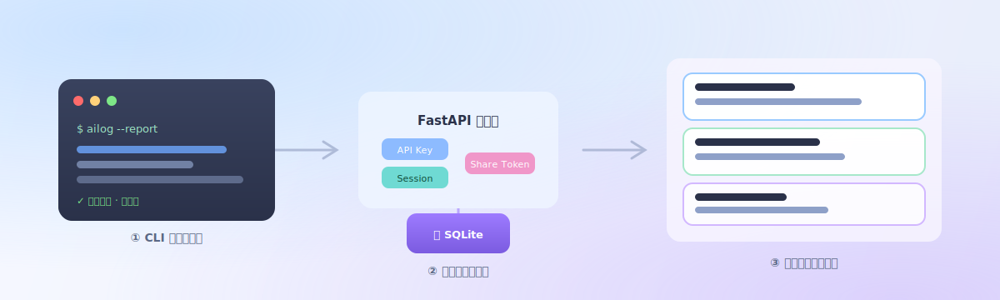
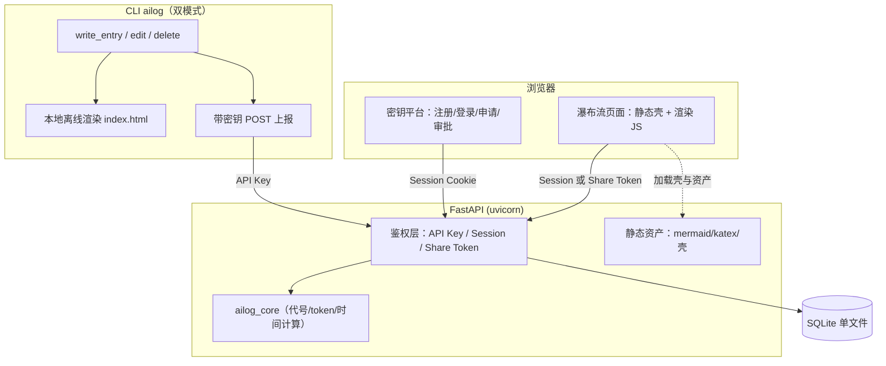
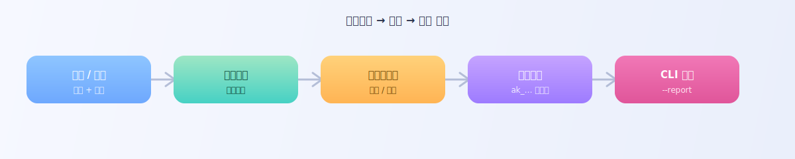
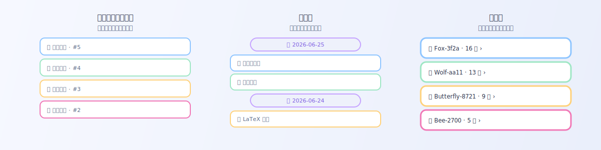

# Ailogy



把 AI 工作日志从「本地离线单文件」升级为「前后端服务」：CLI 带密钥上报，后端按用户隔离存储到 SQLite，网页以瀑布流呈现，可**按日期 / 按会话 / 忽略日期**三种视图无限下滑查看。

> 本仓库脱胎于 [claude-skills 的 ai-log skill](https://github.com/icloudsheep/claude-skills)。原本的纯本地离线工具仍保留，本项目在其之上增加后端、数据库与密钥平台。

---

## 它能做什么

- **CLI 双模式**：`ailog` 命令照常在本地生成离线 HTML，同时可带 API 密钥把日志上报后端；断网不影响本地，恢复后自动补发。
- **瀑布流查看**：所有日志集中在数据库里，网页无限下滑，三种视图随心切换，支持 Markdown / Mermaid 图 / LaTeX 公式渲染、全文搜索。
- **密钥平台**：用户注册登录后申请密钥，管理员审批发放。
- **多用户隔离 + 公开分享**：默认只能看自己的；可逐范围（全部 / 某天 / 某会话）生成公开只读分享链接。

---

## 架构一览



核心取舍：**渲染留前端、后端只吐 JSON**。纯渲染逻辑（Markdown / Mermaid / KaTeX）在 CLI 离线模式与网页瀑布流两处复用；后端只做数据与鉴权。

---

## 快速开始

### 1. 安装依赖

需要 Python 3.9+。

```bash
git clone https://github.com/icloudsheep/Ailogy.git
cd Ailogy
python3 -m venv .venv
.venv/bin/pip install -e .          # 安装后端 + CLI 及依赖
```

### 2. 启动与运维

统一运维入口 `./ailogy`（也可用 `./run.sh` 前台启动）：

```bash
./ailogy daemon          # 后台启动（PID→.ailogy.pid，日志→ailogy.log）
./ailogy start           # 前台启动（Ctrl+C 停；start --reload 开发热重载）
./ailogy status          # 查看运行状态
./ailogy restart         # 重启
./ailogy stop            # 停止
./ailogy logs            # 跟踪日志

# 管理员运维
./ailogy review          # 交互式逐条审批待审的密钥申请（推荐）
./ailogy apps            # 列出待审申请
./ailogy approve <id> [备注]   # 批准并打印明文密钥
./ailogy reject  <id> <理由>   # 拒绝
./ailogy make-admin <邮箱>     # 升级为管理员
```

> 配置（DB 路径 / HOST / PORT / CORS / cookie / 版本）都从仓库根 `.env` 读取（参照
> `.env.example`，首次运行自动生成）；`PYTHONPATH` 由脚本设置（解释器启动前必须就位，无法写进 .env）。

启动后访问下列页面：

| 地址 | 用途 |
| --- | --- |
| `http://127.0.0.1:8000/account` | 账户：注册 / 登录 / 退出 / 个人信息 |
| `http://127.0.0.1:8000/platform` | 密钥：密钥管理 / 申请 / 审批（需登录）|
| `http://127.0.0.1:8000/` | 瀑布流（需先登录） |
| `http://127.0.0.1:8000/?share=<token>` | 公开分享链接（匿名只读） |

### 3. 注册账号 + 拿到密钥

打开 `/platform`：



1. **注册**（首个注册的用户自动成为管理员）。
2. 在「申请 API 密钥」提交申请，或直接「+ 自助新建」一个密钥。
3. 管理员可在密钥页审批，或用统一入口：
   ```bash
   ./ailogy review                 # 交互式逐条审批（推荐）
   ./ailogy apps                   # 列待审申请
   ./ailogy approve <id> [备注]     # 批准并打印明文密钥
   ./ailogy reject  <id> <理由>     # 拒绝
   ./ailogy make-admin <邮箱>       # 提升为管理员
   ```
4. 密钥**明文存库、随时可在密钥页复制**（个人自托管的有意取舍）；删除不可逆。

### 4. 配置 CLI 上报

把后端地址与密钥写进 `~/.config/ai-log/config.json`：

```json
{
  "root": "~/Quick/AI_log",
  "backend": { "url": "http://127.0.0.1:8000", "api_key": "ak_你的密钥", "report": true }
}
```

或用环境变量（优先级高于配置文件）：

```bash
export AILOG_BACKEND_URL=http://127.0.0.1:8000
export AILOG_API_KEY=ak_你的密钥
```

### 5. 记录并上报日志

```bash
# 本地渲染 + 上报后端（report 已开则默认上报，--report 可临时强制开启）
.venv/bin/ailog --report --title "重构日志系统" --summary "今天把 xxx 拆成了 yyy …"

# 只想本地、不上报：
.venv/bin/ailog --offline --title "草稿" --summary "…"
```

上报失败不会阻断本地写入——条目进待重发队列，下次运行 CLI 时自动补发。

### 6.（可选）导入既有 ai-log 历史数据

如果你之前用本地 ai-log 攒了按天目录的 `data.json`，一次性灌进库：

```bash
AILOGY_DB=./ailogy.db .venv/bin/python scripts/import_datajson.py ~/Quick/AI_log
```

---

## 三种视图

刷新页面顶部的标签即可切换：



- **全部**：忽略日期，一条不漏的时间倒序流。
- **按日期**：跨天时插入日期分隔头。
- **按会话**：先列出会话（每会话一个稳定的「emoji + 动物名」代号），点进去看该会话的全部条目。

页面还支持全文搜索（标题 / 正文 / 项目 / 分支等，关键词高亮），点结果直接弹出该条详情。

---

## 公开分享

在自己的页面把某个范围设为公开，会生成一个 `?share=<token>` 链接，匿名访客只读可见：

- 范围可选 `全部` / `某一天` / `某个会话`。
- 默认全部私有，公开是显式动作。
- 转回私有会**立即吊销**旧链接（404）。

---

## 目录结构

```
Ailogy/
├── packages/
│   ├── ailog_core/     # 纯逻辑：会话代号派生、token 统计、时间计算、entry 模型（CLI 与后端共用）
│   └── ailog_cli/      # 本地 CLI：写 data.json + 离线渲染 + 可选带密钥上报（reporter）
├── backend/app/        # FastAPI：路由(routers/)、ORM 模型、DB、鉴权(deps)、安全(security/ratelimit)
├── frontend/
│   ├── shared/js/      # 纯渲染：markdown / mermaid / katex / 格式化工具（前后端两场景复用）
│   ├── viewer/         # 瀑布流页面（静态壳 + API 分页拉取 + 搜索）
│   └── platform/       # 密钥平台前端（注册/登录/申请/审批）
├── vendor/             # mermaid.min.js / katex / version.js（后端静态路由提供，离线可用）
├── scripts/            # import_datajson（导入）/ admin（审批）
└── tests/              # pytest（46 项：鉴权/幂等/分页/隔离/分享/限流）
```

---

## 开发与测试

```bash
.venv/bin/python -m pytest -q     # 全量单测
```

测试覆盖：会话代号确定性、时间计算、入库幂等、cursor 分页不重不漏、三视图、详情 IDOR 防护、
注册登录会话、申请审批发密钥、密钥吊销、跨用户隔离、公开分享流转、限流防爆破等。

---

## 安全说明

- 密码 **argon2id** 哈希；API 密钥只存 **sha256 + 前缀**，明文仅创建时返回一次，可吊销。
- 会话用服务端表 + httponly / SameSite=Lax cookie；登录 / 注册 / 申请 / ingest 有 **IP 限流**（防爆破）。
- 读取 / 编辑强制 **user_id 归属校验**（防 IDOR）；页面默认私有，转私即吊销分享链接。
- ⚠️ 本地运行是**无 TLS 的明文 http**，仅限本机 / 内网。对外暴露务必置于 **https 反向代理**之后，
  并把 cookie 的 `secure` 置 true、收紧 CORS 白名单。

---

## 里程碑

M0 核心抽取 + 骨架 · M1 三视图瀑布流 · M2 账号与密钥平台 · M3 CLI 上报双模式 · M4 多用户隔离与分享 · M5 安全加固（全部完成）。

## 许可证

[MIT](LICENSE)
